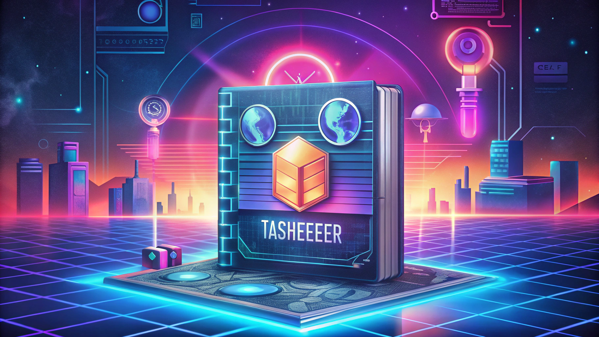

<br />
<div align="center">
  <a href="https://github.com/abdelrahmanmah/Tashfeer">
    <!-- You can create a simple logo or use an emoji -->
    <!-- Option 1: Emoji -->
    <h1 style="font-size: 4em;">🕶️</h1>
    <!-- Option 2: Simple Text Logo (if you prefer) -->
    <!--  -->
  </a>

  <h3 align="center">Tashfeer - The Cipher Suite</h3>

  <p align="center">
    An interactive web application for encrypting and decrypting messages using classic ciphers.
    <br />
    Your personal digital enigma machine!
    <br />
    <a href="https://github.com/abdelrahmanmah/Tashfeer/issues">Report Bug</a>
    ·
    <a href="https://github.com/abdelrahmanmah/Tashfeer/issues">Request Feature</a>
  </p>
</div>

<!-- TABLE OF CONTENTS -->
<details>
  <summary>Table of Contents</summary>
  <ol>
    <li>
      <a href="#about-the-project">About The Project</a>
      <ul>
        <li><a href="#built-with">Built With</a></li>
      </ul>
    </li>
    <li>
      <a href="#getting-started">Getting Started</a>
      <ul>
        <li><a href="#prerequisites">Prerequisites</a></li>
        <li><a href="#installation">Installation</a></li>
      </ul>
    </li>
    <li><a href="#usage">Usage</a></li>
    <li><a href="#cipher-protocols">Cipher Protocols</a></li>
    <li><a href="#roadmap">Roadmap</a></li>
    <li><a href="#contributing">Contributing</a></li>
    <li><a href="#license">License</a></li>
    <li><a href="#authors-and-contact">Authors and Contact</a></li>
    <li><a href="#acknowledgments">Acknowledgments</a></li>
  </ol>
</details>

<!-- ABOUT THE PROJECT -->
## About The Project 🚀

 <!-- TODO: Add a screenshot URL or path e.g. images/screenshot.png -->
<!-- If you deploy it, you can replace the GitHub link with the live URL -->

Welcome, Agent! **Tashfeer** (تشفير - Arabic for "encryption") is your go-to digital toolkit for exploring the fascinating world of classical cryptography. This Streamlit-powered application allows you to:

*   🔒 **Encrypt** sensitive intel before transmission.
*   🔓 **Decrypt** intercepted messages.
*   🔀 Apply **Transposition Ciphers** that rearrange the order of characters.
*   🔄 Employ **Substitution Ciphers** that replace characters with others.
*   ✨ Combine both techniques for **layered security**.

Tashfeer is designed to be intuitive for beginners while offering a glimpse into the core concepts that underpin modern secure communication. Whether you're a budding cryptographer, a puzzle enthusiast, or just looking to send secret messages, Tashfeer has you covered!

### Key Features:
*   **Interactive UI**: Easy-to-use interface powered by Streamlit.
*   **Multiple Cipher Choices**:
    *   🚧 Rail Fence Cipher
    *   📊 Row Transposition Cipher
    *   🅰️ Caesar Cipher
    *   🔑 Vigenère Cipher
*   **Combined Operations**: Encrypt with substitution then transposition, or decrypt in reverse order.
*   **Dynamic Key Inputs**: Tailor keys for each specific cipher.
*   **Real-time Feedback**: Status updates and error handling during operations.
*   **Cipher Briefings**: In-app explanations for each protocol.

### Built With

### Built With

* [![Streamlit][streamlit-badge]][streamlit-url]
* [![Python][python-badge]][python-url]
* [![NumPy][numpy-badge]][numpy-url]
* [![VS Code][vscode-badge]][vscode-url]
* [![GitHub][github-badge]][github-url]

[streamlit-badge]: https://img.shields.io/badge/Streamlit-FF4B4B?style=for-the-badge&logo=Streamlit&logoColor=white
[streamlit-url]: https://streamlit.io/
[python-badge]: https://img.shields.io/badge/Python-3776AB?style=for-the-badge&logo=python&logoColor=white
[python-url]: https://www.python.org/
[numpy-badge]: https://img.shields.io/badge/Numpy-013243?style=for-the-badge&logo=numpy&logoColor=white
[numpy-url]: https://numpy.org/
[vscode-badge]: https://img.shields.io/badge/VS_Code-007ACC?style=for-the-badge&logo=visual-studio-code&logoColor=white
[vscode-url]: https://code.visualstudio.com/
[github-badge]: https://img.shields.io/badge/GitHub-181717?style=for-the-badge&logo=github&logoColor=white
[github-url]: https://github.com/

<!-- GETTING STARTED -->
## Getting Started 🕵️‍♂️

To get your local copy of Tashfeer up and running, follow these simple steps.

### Prerequisites

Ensure you have Python (3.7+ recommended) and pip installed on your system.
*   Python & pip
    ```sh
    # Check Python version (usually comes with pip)
    python --version
    pip --version
    ```

### Installation

1.  **Clone the Mission Files (Repository)**:
    ```sh
    git clone https://github.com/abdelrahmanmah/Tashfeer.git
    cd Tashfeer
    ```
2.  **Install Required Packages (Intel)**:
    It's recommended to use a virtual environment.
    ```sh
    # Create a virtual environment (optional but good practice)
    python -m venv venv
    # Activate it:
    # Windows
    # venv\Scripts\activate
    # macOS/Linux
    # source venv/bin/activate

    pip install -r requirements.txt
    ```
3.  **Launch the Cipher Engine**:
    ```sh
    streamlit run project3.py
    ```
    Your default web browser should automatically open Tashfeer!

<!-- USAGE EXAMPLES -->
## Usage 🛠️

Once Tashfeer is running:

1.  **Select Your Objective**: Choose `🔒 Encrypt` or `🔓 Decrypt` from the sidebar.
2.  **Choose Your Strategy**:
    *   `🔀 Transposition Only`: For ciphers that rearrange letters.
    *   `🔄 Substitution Only`: For ciphers that swap letters.
    *   `✨ Combined`: For a two-layer operation (Substitution then Transposition for encryption; Transposition then Substitution for decryption).
3.  **Select Protocol(s)**: Based on your strategy, choose the specific cipher algorithm(s) (e.g., Rail Fence, Caesar).
4.  **Enter Key(s) 🗝️**: Provide the necessary key for the selected cipher(s) (e.g., number of rails, keyword, shift value). Helper text will guide you.
5.  **Input Your Message 📝**: Type or paste your plaintext (for encryption) or ciphertext (for decryption) into the "Input" text area.
6.  **Engage Cipher Engine! 🚀**: Click the button to process your message.
7.  **Retrieve Output 📦**: The processed message will appear in the "Output" text area. Success messages and balloons will confirm mission accomplishment!

Access the `📖 Cipher Protocol Briefings` expander at the bottom for a detailed explanation of how each cipher works and the operational flow.

<!-- TODO: You'll want to take a screenshot of your app and save it in an `images` folder in your repo, then update the [product-screenshot] link above. -->
<!-- Example:  -->
<!-- If you can create a GIF, that's even better! -->

<!-- CIPHER PROTOCOLS -->
## Cipher Protocols 📜

Tashfeer implements the following classical ciphers:

*   **Transposition Ciphers (Rearrangement)**
    *   `🚧 Rail Fence Cipher`: Writes plaintext diagonally downwards on successive "rails" of an imaginary fence, then reads off row by row.
        *   *Key*: Number of rails (integer ≥ 2).
    *   `📊 Row Transposition Cipher`: Writes plaintext into a grid and reorders the columns based on a keyword.
        *   *Key*: A keyword (string of letters).

*   **Substitution Ciphers (Letter Swapping)**
    *   `🅰️ Caesar Cipher`: Each letter in the plaintext is shifted a certain number of places down or up the alphabet.
        *   *Key*: Shift value (integer 0-25).
    *   `🔑 Vigenère Cipher`: A polyalphabetic substitution using a keyword to determine various Caesar shifts in sequence.
        *   *Key*: A keyword (string of letters).

*   **`✨ Combined Operations`**:
    *   **Encryption**: Substitution cipher is applied first, followed by a transposition cipher on the result.
    *   **Decryption**: Transposition cipher is decrypted first, followed by substitution cipher decryption on the result.


<!-- AUTHORS AND CONTACT -->
## Authors and Contact 📞

This project was developed by the talented team:

*   **Abdelrahman Mahmoud** - [abdelrahmanmah](https://github.com/abdelrahmanmah)
*   **Gannatullah Asaad** - [Gannatullah](https://github.com/GannaAsaad) <!-- TODO: Add Gannatullah's GitHub handle if available -->
*   **Ali Mohamed** - [Ali Mohamed](https://github.com/AliiiMohamedAliii) <!-- TODO: Add Ali's GitHub handle if available -->
*   **Ahmed Khaled** - [Ahmed's GitHub Handle](https://github.com/Holako22) <!-- TODO: Add Ahmed's GitHub handle if available -->

Project Link: [https://github.com/abdelrahmanmah/Tashfeer](https://github.com/abdelrahmanmah/Tashfeer)

<!-- ACKNOWLEDGMENTS -->
## Acknowledgments 🙏

*   Dr/ Nermein, TA/ Nada
*   Our dedicated team: Gannatullah Asaad, Ali Mohamed, and Ahmed Khaled.
*   Inspired by the world of cryptography and secret codes.
*   [Othneil Drew's Best-README-Template](https://github.com/othneildrew/Best-README-Template) for the structural inspiration.
*   The Streamlit community for an amazing framework.
*   All the pioneers of classical ciphers.
